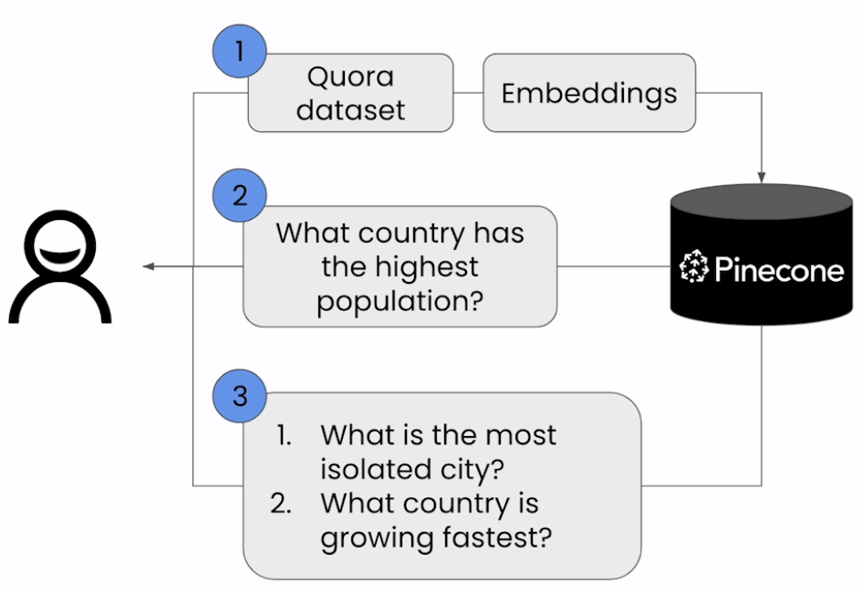

# Semantic Search

- Step #1: Create embeddings of Quora dataset
- Step #2: Query the dataset

## Notebook

- [Jupyter Notebook](../code/Lesson_1_Semantic_Search.ipynb)
- Pinecone Datasets
  - [PyPi page](https://pypi.org/project/pinecone-datasets/)
  - [Pinecone documentation](https://docs.pinecone.io/guides/data/using-public-pinecone-datasets)
- Sentence Transformers
  - [PyPi page](https://pypi.org/project/sentence-transformers/)
  - [Homepage](https://www.sbert.net/)
- [Slice splits](https://huggingface.co/docs/datasets/loading#slice-splits) shows how to select specific rows of train split.
- [Pinecone initialize documentation](https://docs.pinecone.io/reference/pinecone-clients#initialize)
- Issue faced on executing locally:
  - `load_dataset` failed to find [quora](https://huggingface.co/datasets/quora) .parquet file
    - My issue is likely due to conflict between the dependencies of libraries as discussed in [HuggingFace discussion thread](https://discuss.huggingface.co/t/load-dataset-cant-find-hosted-public-parquet-files/68105). I was using a conda environment from previous project.
    - **Solution**: Created a new [conda environment](https://conda.io/projects/conda/en/latest/user-guide/tasks/manage-environments.html#creating-an-environment-with-commands) and installed the libraries with the versions mentioned in [requirements.txt](../code/requirements.txt)
