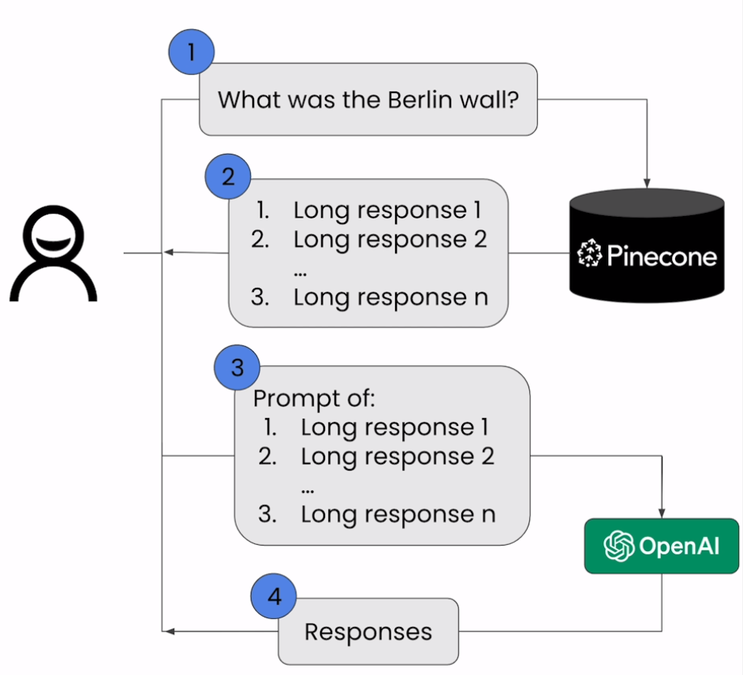

# Retrieval Augmented Generation (RAG)

## Architecture Diagram

## Notebook

- [Jupyter Notebook](../code/Lesson_2_Retrieval_Augmented_Generation.ipynb)
- Change in my notebook compared to the one shared in course
  - The course notebook prepends `write an article titled: ` to the query question which is then used for nearest neighbor search in the Pinecone database.
  - Whereas I have kept that phrase only for the prompt and nearest neighbor search is done only on the original query.

- openai version issue:
  - `from openai import OpenAI` fails in the version 0.28.1
  - Updated to version 0.28.1 based on the notebook shared online.
  - Discussion in [OpenAI forum](https://community.openai.com/t/cannot-import-name-openai-from-openai/486147)

- [Create directory to download](https://stackoverflow.com/a/11258300/282155) wiki.csv
- [OpenAI Dec 2022 blog](https://openai.com/blog/new-and-improved-embedding-model) introducing the model: `text-embedding-ada-002`
