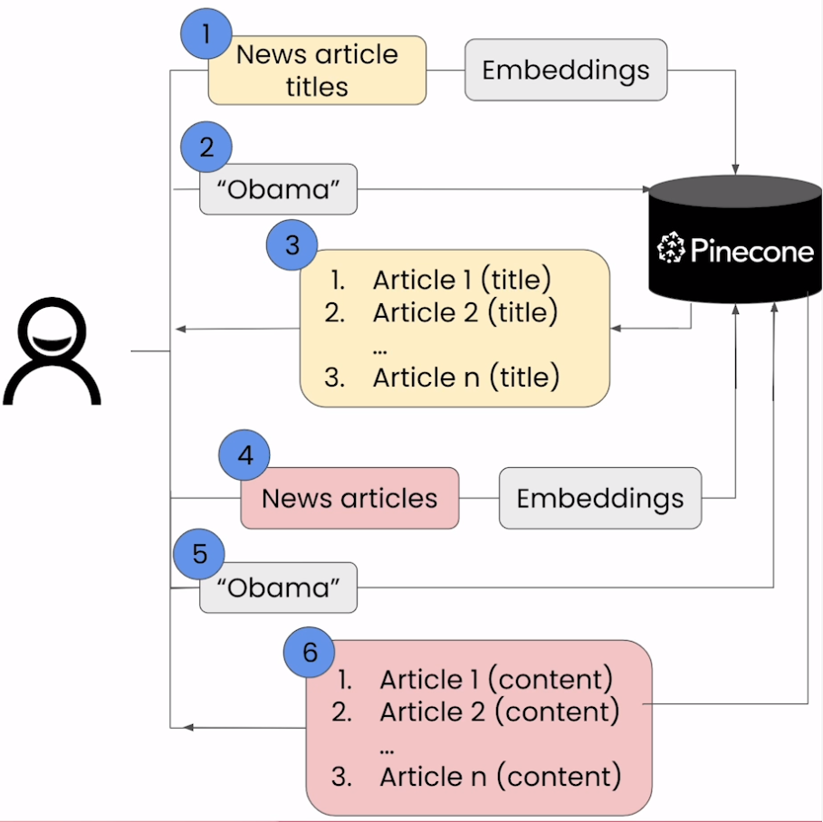

# Recommender Systems

## Flow Diagram

## Notebook

- [Jupyter Notebook](../code/Lesson_3_Recommender_Systems.ipynb)
- Issue
  - While upserting the records of news title embeddings, the vectors are not created in an efficient way. The vectors should be extended in such a way that even if chunk size is less than the threshold (200) it should be taken care of.
