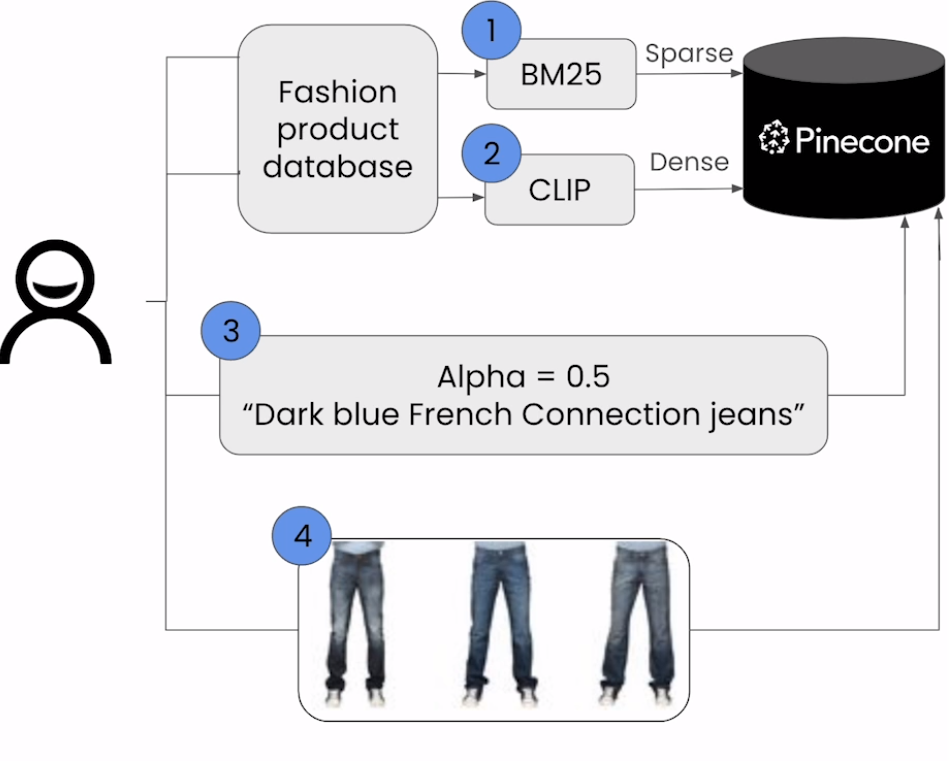

# Hybrid Search

- Pinecone supports vectors with dense and sparse values allowing hybrid search.
- Pinecone article: [Getting Started with Hybrid Search](https://www.pinecone.io/learn/hybrid-search-intro/)

## Flow Diagram

## Sparse vector using BM25

- BM25
  - A ranking function that is used to retieve text by estimating the relative importance of terms in the text to the search query.

## CLIP

- Contrastive Language-Image Pre-Training
- Neural network trained on a variety of (image, text) pairs.
- Maps an image to text/caption to describe the image.

## Additional Info (KA)

- [StackOverFlow blog](https://stackoverflow.blog/2023/10/09/from-prototype-to-production-vector-databases-in-generative-ai-applications/#h3-372dee15b9940) mentions implementaton of hybrid search in StackOverFlow.
- [HuggingFace's clip-ViT-B-32 page](https://huggingface.co/sentence-transformers/clip-ViT-B-32)
- [Pinecone docs on hybrid search](https://docs.pinecone.io/guides/data/query-sparse-dense-vectors)

## Notebook

- [Jupyter Notebook](../code/Lesson_4_Hybrid_Search.ipynb)
- [Cosine similarity vs Dot product](https://datascience.stackexchange.com/questions/744/cosine-similarity-versus-dot-product-as-distance-metrics)
- Pre-trained models of `sentence_transformers` are [hosted on HuggingFace Model Hub](https://www.sbert.net/docs/pretrained_models.html).
