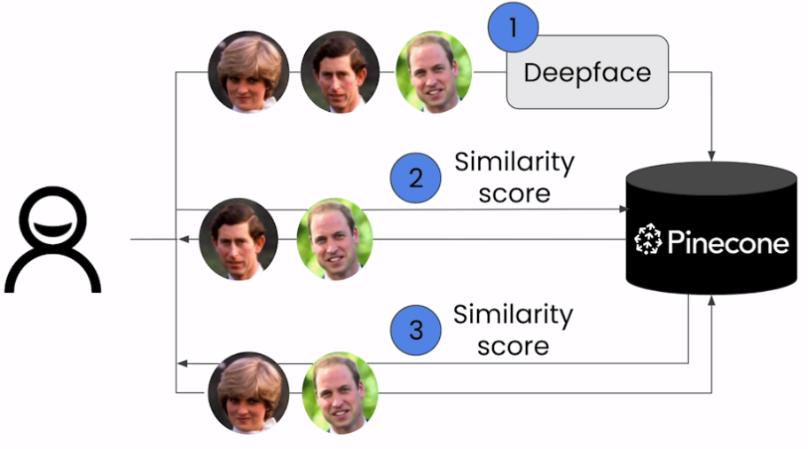

# Facial Similarity Search

## Flow Diagram

## Visualize a data of images

- Two steps:
  - **PCA**: Preliminary step to reduce the dimension of our data of embeddings.
  - **T-SNE plot**: To plot the data after PCA.
    - As this is computationally expensive, applying PCA first provides significant speed-up.

- Perplexity
  - A key hyper-parameter of t-SNE.
  - Represents the number of beighbors each data point has in the higher dimensional space.

## t-SNE plot

- t-Distributed Stochastic Neighbour Embedding
- Tool to visualize high dimensional data e.g. data of multiple image embeddings.
- It works by grouping similar data points together based on their similarities in the higher dimensional space.
- This technique is highly effective for understanding complex datasets.
- Allows for identifying patterns and clusters and uncovering connections between data points that may not be immediately obvoius in higher dimensions.

## Additional resource

- [Pinecone's blog on Dimensionality Reduction](https://www.pinecone.io/learn/dimensionality-reduction/)

## Notebook

- [Jupyter Notebook](../code/Lesson_5_Facial_Similarity_Search.ipynb)
  - Unlike previous notebooks, `vectors` input in `upsert` is of type list of tuple.
  - Performance concern
    - Isn't upserting one row at a time instead of batch of rows a bad idea?
  - Observation
    - The t-SNE scatter plot shows `child` cluster closer to `mom` cluster copared to `dad` cluster.
    - Whereas the average similarity score for `dad` and `child` is better than `mom` and `child`.
    - The two seems to be contradicting. 
- Issues faced on executing in WSL Ubuntu
  - ImportError: libGL.so.1
    - `ImportError: libGL.so.1: cannot open shared object file: No such file or directory`
    - Solution: Install `libgl1` as suggested in [StackOverFlow thread](https://stackoverflow.com/a/68666500/282155)
  - `ImportError: cannot import name 'LocallyConnected2D' from 'tensorflow.keras.layers'`
    - Solution:
      - Installed latest version of deepface: 0.0.89
      - Throws the error: `ValueError: You have tensorflow 2.16.1 and this requires tf-keras package.`
        - Solution: `pip install tf-keras`
    - [StackOverFlow discussion](https://stackoverflow.com/questions/78131429/importerror-cannot-import-name-locallyconnected2d-from-tensorflow-keras-laye)
- Which version of `deepface` is installed in the course lab's AWS page?
  - Couldn't figure out as `DeepFace.__version__` is not available.
    - This was likely added in the version 0.0.87
    - `deepface.DeepFace.tf.__version__` showed TensorFlow version as 2.15.0
- Author's suggestion
  - In [PyPi page](https://pypi.org/project/deepface/), under the section **FAQ and Troubleshooting**, author writes `Additionally, it is possible to encounter issues due to recently released dependencies, primarily Python itself or TensorFlow.`
