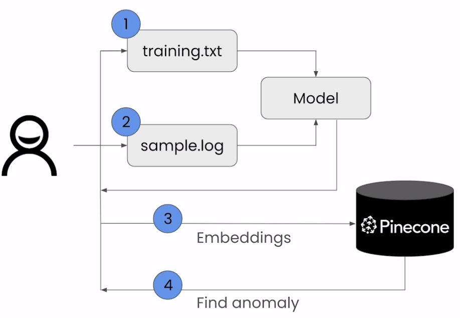

# Anomaly Detection

## Objective

- Detect anomalies in Cisco ASA (Adaptive Security Appliance) log file.

## Flow Diagram

## Notebook

- [Jupyter Notebook](../code/Lesson_6_Anomaly_Detection.ipynb)
